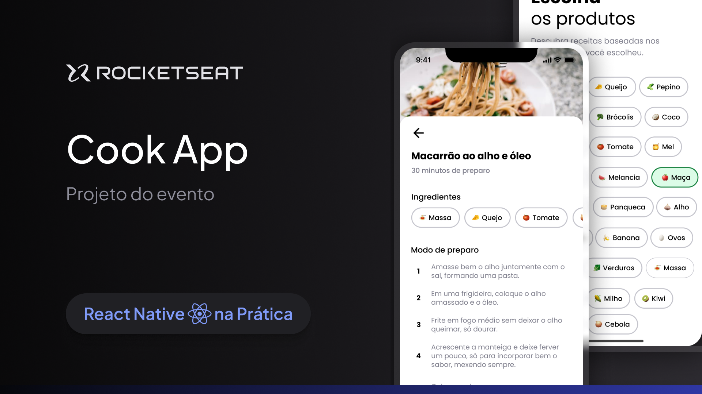

### Links

🔴 **Figma do projeto:** [Cook App](https://www.figma.com/community/file/1346604268107725445/cook-app)

---

### Sobre o projeto

Imagine chegar em casa com fome depois de um dia de muito trabalho e lembrar que você esqueceu de passar no mercado para fazer as compras da semana. Então você decide abrir a geladeira pra fazer uma janta com o que já tem em casa, mas está sem muita criatividade pra cozinhar.
**É esse problema que o Cook App pode resolve!** Nessa aula do evento React Native na prática vamos criar uma aplicação que sugere receitas conforme os ingredientes selecionados **usando React Native, Expo, Expo router, Supabase e React Native reanimated**.

## Funcionalidades Principais

- **Sugestão de Receitas Personalizadas:** Receba sugestões de receitas com base nos ingredientes que você tem disponíveis em casa.
- **Interface Amigável:** Interface intuitiva e fácil de usar, projetada com React Native e Expo.
- **Integração com Supabase:** Armazena e recupera dados de receitas utilizando o Supabase como banco de dados.
- **Animações Suaves:** Utiliza a biblioteca React Native Reanimated para criar animações fluidas e uma experiência de usuário envolvente.

## Tecnologias Utilizadas
- Expo
- Google Fonts
- Animação - React Native Reanimated
- Banco de Dados - SupaBase
- TypeScript
- e muito mais

## Como Utilizar

### Instalação do Projeto:

1. Clone este repositório em sua máquina local.
2. Navegue até o diretório do projeto e execute `npm install` para instalar as dependências.

### Execução do Projeto:

1. Certifique-se de ter o ambiente Expo configurado em sua máquina.
2. Execute `expo start` para iniciar o servidor de desenvolvimento.

### Explorando o Cook App:

1. Abra o aplicativo Expo em seu dispositivo móvel ou em um emulador.
2. Explore as diversas receitas disponíveis com base nos ingredientes que você possui.

## Tecnologias Utilizadas

- React Native
- Expo
- Expo Router
- Supabase
- React Native Reanimated

## Licença

Este projeto está licenciado sob a MIT License.

---
